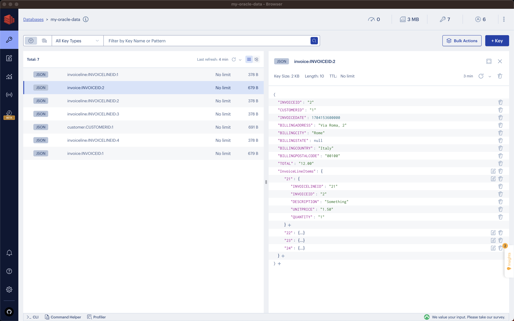

# Redis Enterprise - Una soluzione per il Change Data Capture

## Contesto

Nell'ambito tecnologico odierno, caratterizzato da una crescente centralità dei dati nelle strategie decisionali aziendali,
l'efficienza e la tempestività nel trasferimento delle informazioni sono diventate indispensabili.
In questo contesto, il Change Data Capture (CDC) si rivela una soluzione strategica per rispondere efficacemente a tali esigenze,
facilitando una gestione agile e in tempo reale dei dati.

Al di là degli aspetti puramente tecnologici, un altro elemento di vitale importanza per le aziende è rappresentato dalla riduzione dei costi.
Integrare innovazione con una diminuzione significativa delle spese costituisce una combinazione ideale che soddisfa
sia la necessità di aggiornamento tecnologico sia quella di razionalizzazione economica, rappresentando così l'obiettivo ottimale per le imprese.

Molte piattaforme di gestione dati adottano un modello di licenza che dipende dal volume di utilizzo, dove l'intensità dell'attività,
quantificata attraverso il numero di query e l'utilizzo dei core, incide direttamente su indicatori quali i MIPS (milioni di istruzioni per secondo).
Un approccio efficace per contenere sia il consumo di risorse sia i relativi costi consiste nello spostare i dati su sistemi secondari,
soprattutto per le operazioni di lettura. Questa strategia può comportare una riduzione notevole sia nel consumo di risorse sia nei costi.

L'introduzione di una nuova piattaforma dati può comportare un aumento della complessità architetturale e dei costi.
Tuttavia, i benefici in termini di riduzione dei costi che tali sistemi possono apportare sono talmente significativi
da rendere l'investimento sostenibile e conveniente. L'adozione di tali soluzioni tecnologiche favorisce l'innovazione,
migliorando la scalabilità e l'efficienza dell'infrastruttura tecnologica.

In questo scenario, Redis Enterprise si distingue come una soluzione efficace per il Change Data Capture (CDC) nelle
piattaforme di gestione dati che utilizzano un modello di licenza basato sul consumo.
L'impiego di Redis Enterprise consente di alleggerire il carico sulle piattaforme primarie di gestione dati, in particolare
per le operazioni di lettura, contribuendo così alla riduzione dell'utilizzo dei core e dei costi associati.

La sua efficacia nel gestire i dati con prestazioni elevate e bassa latenza si traduce in operazioni più rapide ed efficienti.
La scalabilità dell'architettura di Redis Enterprise facilita l'adattamento all'incremento del volume dei dati,
mantenendo il controllo sui costi.
La sua flessibilità nell'integrarsi con varie architetture esistenti rende Redis Enterprise una soluzione ideale
per l'innovazione nell'architettura dei dati. Questa ottimizzazione, che comporta vantaggi in termini di efficienza e
scalabilità, si allinea perfettamente con l'obiettivo di contenimento dei costi, confermando il valore dell'investimento
in questa avanzata soluzione tecnologica.

## Introduzione

L'articolo si dedica ad analizzare in profondità il processo di implementazione di un sistema di Change Data Capture (CDC) efficace,
prendendo come caso di studio il database Oracle 19c come sorgente dati. Si esaminerà l'impiego di Debezium, un rinomato
strumento open-source per il tracciamento delle modifiche ai dati, e si discuterà come, mediante l'uso di Redis Enterprise,
si possa sviluppare un sistema integrato e performante per la gestione dei dati.

Questo approccio non solo assicura un aggiornamento dei dati in tempo reale, ma fornisce anche una soluzione architetturale
scalabile e flessibile, rispondendo così alle esigenze in continua evoluzione del mercato attuale.

<p align="center"></p>

# Stack tecnologico

## Oracle 19c: La Sorgente Dati

Oracle è un sistema di gestione di database relazionali che si distingue per la sua robustezza e affidabilità, 
non a caso scelto da moltissime aziende.
La configurazione iniziale di Oracle 19c è cruciale: dobbiamo assicurarci che il database sia predisposto a registrare
tutte le transazioni e le modifiche in modo che possano essere successivamente catturate e trasmesse dal sistema CDC.
Questo include l'attivazione di funzionalità specifiche, come il log mining, che permettono a Debezium di monitorare e
catturare ogni mutamento avvenuto all'interno dei dati (strutture comprese).
Attraverso un'accurata configurazione e un monitoraggio meticoloso, Oracle 19c diventa non solo un deposito di dati,
ma una fonte dinamica e reattiva, pronta a integrarsi efficacemente nell'architettura CDC.

<p align="center"></p>

## Debezium: Il Cuore del CDC

Debezium svolge un ruolo centrale nel nostro ecosistema CDC, agendo come il vero motore del sistema di cattura dei cambiamenti.
Questa soluzione open-source, specializzata nel monitoraggio delle modifiche in tempo reale, funge da ponte vitale tra
la nostra sorgente dati, Oracle 19c, e il resto dell'architettura di gestione dei dati.

Il suo compito principale è di rilevare e registrare ogni singola modifica avvenuta all'interno del database Oracle,
trasmettendo queste informazioni in modo affidabile e senza interruzioni.
L'installazione e la configurazione di Debezium richiedono un'attenzione particolare: è fondamentale assicurarsi che la
comunicazione con Oracle 19c sia ottimizzata e che le funzionalità come il log mining siano correttamente impostate.
Questo passo garantisce che Debezium possa catturare ogni cambiamento in modo efficiente, fornendo una base solida e
affidabile per il flusso continuo dei dati all'interno del nostro ambiente CDC.

<p align="center"></p>

## Redis Data Integration: Pipeline di Flusso Dati

Nel cuore del nostro sistema CDC, Redis Data Integration emerge come un componente fondamentale per la gestione e l'orchestrazione delle pipeline di dati.
Questa piattaforma gioca un ruolo cruciale come intermediario tra Debezium e il nostro database target, Redis Enterprise, facilitando il movimento e la trasformazione dei dati.

Nel processo di movimentazione dei dati, la loro trasformazione diventa un aspetto imprescindibile, necessario per ottenere livelli di ottimizzazione e innovazione precedentemente non raggiungibili.
Questa pratica comporta l'adattamento e il rimodellamento dei dati in modo che rispondano a nuove esigenze e caratteristiche, rendendoli più adeguati al loro effettivo utilizzo.
Una parte essenziale di questo processo è l'aggregazione dei dati, che consiste nel combinare informazioni provenienti da diverse fonti per creare un insieme di dati più coerente, informativo e utile.
L'aggregazione permette non solo di ottenere una visione più completa e integrata dei dati, ma facilita anche analisi più accurate.

Oltre a gestire il flusso di dati da Debezium a Redis Enterprise, Redis Data Integration si distingue per la sua capacità di gestire il flusso di dati in modo bidirezionale.
Questa caratteristica bidirezionale si manifesta in due modi principali. Per prima cosa, la piattaforma supporta l'ingestione di dati dalla sorgente, Oracle 19c, verso il database target, Redis Enterprise.
Questo permette di catturare e trasferire le modifiche dei dati in tempo reale in un flusso diretto e ininterrotto. Inoltre, Redis Data Integration offre la possibilità di spostare i dati da Redis Enterprise verso le sorgenti dati.
Questo è particolarmente utile nell'implementazione dei pattern di caching, come ad esempio il "write-through" e il "write-behind".

<p align="center"></p>


I pattern di caching appena menzionati rappresentano una strategia efficace nella gestione dei dati.
Questi permettono di registrare i dati in Redis Enterprise, che a sua volta li trasmette verso la principale fonte di dati, in questo caso Oracle 19c.
Se la trasmissione avviene in modo sincrono, si sta adottando il pattern "write-through". Al contrario, con una trasmissione asincrona si applica il pattern "write-behind".

La scelta tra questi due modelli implica un bilanciamento tra consistenza e prestazioni. Nel caso del modello "write-through", si privilegia la consistenza dei dati a scapito delle prestazioni.
Invece, con il pattern "write-behind", si prediligono le prestazioni, accettando una temporanea discrepanza nella consistenza dei dati, che comunque rimane limitata a un intervallo misurabile in millisecondi.

Redis Data Integration non solo facilita un trasferimento dei dati rapido e adattabile, ma contribuisce anche allo sviluppo di un'architettura dati più solida e polivalente, in grado di adattarsi alle mutevoli esigenze del business moderno. 

<p align="center"></p>


## Redis Enterprise: Il Database Target

Redis Enterprise si afferma come il pilastro finale nel nostro schema di Change Data Capture, fungendo da database di destinazione.
La sua reputazione di database ad alte prestazioni e altamente scalabile lo rende la scelta ideale per gestire i flussi di dati in entrata dal nostro processo CDC.
In questa fase cruciale, Redis Enterprise non solo riceve dati da Redis Data Integration, ma li gestisce anche in modo efficiente, garantendo un accesso rapido e affidabile alle informazioni aggiornate.

La configurazione di Redis Enterprise deve essere attentamente ottimizzata per sostenere i volumi di dati in arrivo.
Questo comporta un'attenta pianificazione delle risorse, come la memoria e il processore, e l'implementazione di strategie di partizionamento dei dati, per garantire che il sistema sia in grado di scalare in modo efficace al crescere delle esigenze aziendali.
Inoltre, è fondamentale assicurare che Redis Enterprise mantenga un'elevata disponibilità e resilienza, caratteristiche chiave in un ambiente che richiede un accesso continuo e affidabile ai dati.

L'integrazione di Redis Enterprise nel nostro ambiente CDC non solo fornisce una soluzione robusta per il trattamento dei dati in tempo reale, ma offre anche vantaggi in termini di scalabilità e flessibilità.

Questo consente alle aziende di adattarsi rapidamente alle mutevoli esigenze del mercato e di sfruttare al meglio le opportunità che si presentano, mantenendo sempre un'architettura di dati sicura, affidabile e performante.

<p align="center"></p>

# Implementazione

## Oracle 19c come container Docker

Online ho trovato un'ottima guida disponibile proprio sul sito Oracle.
La guida è di Alex Zaballa, è scritta in portoghese/braziliano, ma decisamente di facile comprensione (da un punto di vista italiano).

Questo il link:

- [https://www.oracle.com/br/technical-resources/articles/database-performance/oracle-db19c-com-docker.html](https://www.oracle.com/br/technical-resources/articles/database-performance/oracle-db19c-com-docker.html)

Inoltre nell'articolo si fa riferimento al repository ufficiale di Oracle su GitHub:

- [https://github.com/oracle/docker-images/tree/master/OracleDatabase](https://github.com/oracle/docker-images/tree/master/OracleDatabase)

Durante la procedura, potrebbero presentarsi alcuni piccoli problemi, tuttavia sono facilmente superabili.

La creazione dell'immagine Docker richiede tempo, così come l'inizializzazione del container.

Questi gli step che ho eseguito:
```bash
git clone https://github.com/oracle/docker-images.git
cd docker-images/
wget https://www.oracle.com/webapps/redirect/signon?nexturl=https://download.oracle.com/otn/linux/oracle19c/190000/LINUX.X64_193000_db_home.zip
cp LINUX.X64_193000_db_home.zip OracleDatabase/SingleInstance/dockerfiles/19.3.0/
cd OracleDatabase/SingleInstance/dockerfiles/
./buildContainerImage.sh -v 19.3.0 -e
```
Bene, ora è il momento di metter su un bel &#x2615;

Una volta terminato questo processo, l'immagine Docker è pronta per l'uso. È necessario un volume per garantire la persistenza dei dati.
Questo è importante non solo per i dati che possono comunque essere ricreati con degli script SQL, ma soprattutto per l'inizializzazione del database, che richiede almeno una decina di minuti.
Prima di eseguire il comando "docker run", è essenziale creare la directory del volume con i permessi appropriati per evitare problemi nell'avvio.

```bash
mkdir oradata
chmod -R o+w oradata
```
Si è ora pronti per avviare l'immagine Docker di Oracle 19c:
```bash
docker run --name oracle19c -p 1521:1521 -p 5500:5500 -v $PWD/oradata:/opt/oracle/oradata oracle/database:19.3.0-ee
```
Dopo aver completato il processo (per dettagli fare riferimento alla guida di Alex Zaballa), è possibile accedere al container e modificare la password dell'utente SYS come indicato di seguito:

```bash
docker exec -it oracle19c ./setPassword.sh Redis.2024
```
Ho scelto "Redis.2024" come password, ma ciascuno ha il suo stile... scegliete la vostra, l'importante è ricordarsela!

```bash
docker exec -it oracle19c /bin/bash
sqlplus sys/Redis.2024 as sysdba
```

Continuiamo ora con la procedura per la creazione e configurazione di un utente dedicato per condurre i test.

La procedura adottata è la seguente:
```sql
SQL> alter session set container=orclpdb1;

Session altered.

SQL> create tablespace redis_tablespace
  2  datafile 'redis_tablespace.dat'
  3  size 10M autoextend on;

Tablespace created.

SQL> create temporary tablespace redis_tablespace_temp
  2  tempfile 'redis_tablespace_temp.dat'
  3  size 5M autoextend on;

Tablespace created.

SQL> create user redis
  2  identified by redis2024
  3  default tablespace redis_tablespace
  4  temporary tablespace redis_tablespace_temp;

User created.

SQL> select username from dba_users;

...

USERNAME
--------------------------------------------------------------------------------
WMSYS
SYSDG
ORDSYS
REDIS

37 rows selected.

SQL> GRANT connect to redis;

Grant succeeded.

SQL> GRANT resource to redis;

Grant succeeded.

SQL> GRANT create session TO redis;

Grant succeeded.

SQL> GRANT create table TO redis;

Grant succeeded.

SQL> GRANT create view TO redis;

Grant succeeded.

SQL> grant unlimited tablespace to redis;

Grant succeeded.
```
Le istruzioni seguite sono state ricavate da varie fonti online, tra cui articoli, forum e post. Tuttavia, è importante sottolineare che queste potrebbero non essere le pratiche migliori, dato che non provengono da un esperto di Oracle. Sono soluzioni trovate per raggiungere il funzionamento desiderato. Anche se gli step sembrano logici, non è garantito che rappresentino la procedura standard.

Il passo successivo è la creazione delle tabelle su cui poi abilitare il Change Data Capture (CDC).
```sql
SQL> CREATE TABLE REDIS.Customer
(
    CustomerId NUMBER NOT NULL,
    FirstName VARCHAR2(40) NOT NULL,
    LastName VARCHAR2(20) NOT NULL,
    Company VARCHAR2(80),
    Address VARCHAR2(70),
    City VARCHAR2(40),
    State VARCHAR2(40),
    Country VARCHAR2(40),
    PostalCode VARCHAR2(10),
    Phone VARCHAR2(24),
    Fax VARCHAR2(24),
    Email VARCHAR2(60) NOT NULL,
    CONSTRAINT PK_Customer PRIMARY KEY  (CustomerId)
);
  2    3    4    5    6    7    8    9   10   11   12   13   14   15   16
Table created.

SQL> CREATE TABLE REDIS.Invoice
(
    InvoiceId NUMBER NOT NULL,
    CustomerId NUMBER NOT NULL,
    InvoiceDate DATE NOT NULL,
    BillingAddress VARCHAR2(70),
    BillingCity VARCHAR2(40),
    BillingState VARCHAR2(40),
    BillingCountry VARCHAR2(40),
    BillingPostalCode VARCHAR2(10),
    Total NUMBER(10,2) NOT NULL,
    CONSTRAINT PK_Invoice PRIMARY KEY  (InvoiceId)
);
  2    3    4    5    6    7    8    9   10   11   12   13
Table created.

SQL> CREATE TABLE REDIS.InvoiceLine
(
    InvoiceLineId NUMBER NOT NULL,
    InvoiceId NUMBER NOT NULL,
    Description VARCHAR2(40) NOT NULL,
    UnitPrice NUMBER(10,2) NOT NULL,
    Quantity NUMBER NOT NULL,
    CONSTRAINT PK_InvoiceLine PRIMARY KEY  (InvoiceLineId)
);
  2    3    4    5    6    7    8    9
Table created.

SQL> ALTER TABLE REDIS.Invoice ADD CONSTRAINT FK_InvoiceCustomerId
    FOREIGN KEY (CustomerId) REFERENCES REDIS.Customer (CustomerId)  ;
  2
Table altered.

SQL> ALTER TABLE REDIS.InvoiceLine ADD CONSTRAINT FK_InvoiceLineInvoiceId
    FOREIGN KEY (InvoiceId) REFERENCES REDIS.Invoice (InvoiceId)  ;
  2
Table altered.
```

Per implementare il Change Data Capture (CDC) con Debezium, è essenziale utilizzare la funzionalità di log mining fornita da Oracle, specificamente attraverso LogMiner.
Questo strumento è cruciale perché Debezium si affida a LogMiner per intercettare e recuperare i cambiamenti nei dati.
LogMiner, in quanto componente integrato di Oracle, permette di analizzare dettagliatamente i log delle transazioni, fornendo a Debezium l'accesso necessario per tracciare le modifiche in tempo reale.

Ecco una citazione diretta dal sito Oracle che approfondisce questo argomento:
> All changes made to user data or to the database dictionary are recorded in the Oracle redo log files so that database recovery operations can be performed.
> Because LogMiner provides a well-defined, easy-to-use, and comprehensive relational interface to redo log files, it can be used as a powerful data auditing tool, and also as a sophisticated data analysis tool.

Il testo completo al seguente link:
- [https://docs.oracle.com/en/database/oracle/oracle-database/21/sutil/oracle-logminer-utility.html#GUID-7B22CA96-37E8-464A-A103-E8F8DA7BB75D](https://docs.oracle.com/en/database/oracle/oracle-database/21/sutil/oracle-logminer-utility.html#GUID-7B22CA96-37E8-464A-A103-E8F8DA7BB75D)

Inizialmente, è necessario creare una directory destinata all'archiviazione dei redo logs:
```bash
mkdir /opt/oracle/oradata/recovery_area

sqlplus sys/Redis.2024 as sysdba
```
```sql
SQL> alter system set db_recovery_file_dest_size = 5G;

System altered.

SQL> alter system set db_recovery_file_dest = '/opt/oracle/oradata/recovery_area' scope=spfile;

System altered.

SQL> shutdown immediate
Database closed.
Database dismounted.
ORACLE instance shut down.
SQL> startup mount
ORACLE instance started.

Total System Global Area 1610610568 bytes
Fixed Size        9136008 bytes
Variable Size     503316480 bytes
Database Buffers   1090519040 bytes
Redo Buffers        7639040 bytes
Database mounted.
SQL> ALTER DATABASE ADD SUPPLEMENTAL LOG DATA;

Database altered.

SQL> alter session set container=CDB$ROOT;

Session altered.

SQL> alter database open;

Database altered.

SQL> alter session set container=orclpdb1;

Session altered.

SQL> ALTER TABLE REDIS.CUSTOMER ADD SUPPLEMENTAL LOG DATA (ALL) COLUMNS;

Table altered.

SQL> ALTER TABLE REDIS.INVOICE ADD SUPPLEMENTAL LOG DATA (ALL) COLUMNS;

Table altered.

SQL> ALTER TABLE REDIS.INVOICELINE ADD SUPPLEMENTAL LOG DATA (ALL) COLUMNS;

Table altered.

SQL> exit
Disconnected from Oracle Database 19c Enterprise Edition Release 19.0.0.0.0 - Production
Version 19.3.0.0.0
bash-4.2$ sqlplus sys/Redis.2024 as sysdba

SQL*Plus: Release 19.0.0.0.0 - Production on Wed Jan 17 10:12:58 2024
Version 19.3.0.0.0

Copyright (c) 1982, 2019, Oracle.  All rights reserved.


Connected to:
Oracle Database 19c Enterprise Edition Release 19.0.0.0.0 - Production
Version 19.3.0.0.0

SQL> CREATE TABLESPACE logminer_tbs DATAFILE '/opt/oracle/oradata/ORCLCDB/logminer_tbs.dbf' SIZE 25M REUSE AUTOEXTEND ON MAXSIZE UNLIMITED;

Tablespace created.

SQL> alter session set container=orclpdb1;

Session altered.

SQL> CREATE TABLESPACE logminer_tbs DATAFILE '/opt/oracle/oradata/ORCLCDB/ORCLPDB1/logminer_tbs.dbf' SIZE 25M REUSE AUTOEXTEND ON MAXSIZE UNLIMITED;

Tablespace created.
```

Quando si apportano modifiche ai dati presenti nelle tabelle `CUSTOMER`, `INVOICE` e `INVOICELINE`, queste modifiche saranno registrate nei file di redo-logs di Oracle.

Procediamo ora alla creazione dell'account utente che Debezium utilizzerà per accedere alle informazioni, assegnando i necessari permessi (GRANTs):

```sql
SQL> alter session set container=cdb$root;

Session altered.

SQL> CREATE USER c##dbzlmuser IDENTIFIED BY dbz DEFAULT TABLESPACE logminer_tbs QUOTA UNLIMITED ON logminer_tbs CONTAINER=ALL;

User created.

SQL> GRANT CREATE SESSION TO c##dbzlmuser CONTAINER=ALL;

Grant succeeded.

SQL> GRANT SET CONTAINER TO c##dbzlmuser CONTAINER=ALL;

Grant succeeded.

SQL> GRANT SELECT ON V_$DATABASE to c##dbzlmuser CONTAINER=ALL;

Grant succeeded.

SQL> GRANT FLASHBACK ANY TABLE TO c##dbzlmuser CONTAINER=ALL;

Grant succeeded.

SQL> GRANT SELECT ANY TABLE TO c##dbzlmuser CONTAINER=ALL;

Grant succeeded.

SQL> GRANT SELECT_CATALOG_ROLE TO c##dbzlmuser CONTAINER=ALL;

Grant succeeded.

SQL> GRANT EXECUTE_CATALOG_ROLE TO c##dbzlmuser CONTAINER=ALL;

Grant succeeded.

SQL> GRANT SELECT ANY TRANSACTION TO c##dbzlmuser CONTAINER=ALL;

Grant succeeded.

SQL> GRANT LOGMINING TO c##dbzlmuser CONTAINER=ALL;

Grant succeeded.

SQL> GRANT CREATE TABLE TO c##dbzlmuser CONTAINER=ALL;

Grant succeeded.

SQL> GRANT LOCK ANY TABLE TO c##dbzlmuser CONTAINER=ALL;

Grant succeeded.

SQL> GRANT CREATE SEQUENCE TO c##dbzlmuser CONTAINER=ALL;

Grant succeeded.

SQL> GRANT EXECUTE ON DBMS_LOGMNR TO c##dbzlmuser CONTAINER=ALL;

Grant succeeded.

SQL> GRANT EXECUTE ON DBMS_LOGMNR_D TO c##dbzlmuser CONTAINER=ALL;

Grant succeeded.

SQL> GRANT SELECT ON V_$LOG TO c##dbzlmuser CONTAINER=ALL;

Grant succeeded.

SQL> GRANT SELECT ON V_$LOG_HISTORY TO c##dbzlmuser CONTAINER=ALL;

Grant succeeded.

SQL> GRANT SELECT ON V_$LOGMNR_LOGS TO c##dbzlmuser CONTAINER=ALL;

Grant succeeded.

SQL> GRANT SELECT ON V_$LOGMNR_CONTENTS TO c##dbzlmuser CONTAINER=ALL;

Grant succeeded.

SQL> GRANT SELECT ON V_$LOGMNR_PARAMETERS TO c##dbzlmuser CONTAINER=ALL;

Grant succeeded.

SQL> GRANT SELECT ON V_$LOGFILE TO c##dbzlmuser CONTAINER=ALL;

Grant succeeded.

SQL> GRANT SELECT ON V_$ARCHIVED_LOG TO c##dbzlmuser CONTAINER=ALL;

Grant succeeded.

SQL> GRANT SELECT ON V_$ARCHIVE_DEST_STATUS TO c##dbzlmuser CONTAINER=ALL;

Grant succeeded.

SQL> GRANT SELECT ON V_$TRANSACTION TO c##dbzlmuser CONTAINER=ALL;

Grant succeeded.

SQL>
```

La definizione dell'elenco delle impostazioni necessarie, dell'ordine appropriato e dei permessi richiesti ha richiesto un considerevole investimento di tempo.
Tuttavia, l'esito positivo finale giustifica lo sforzo impiegato.

## Redis Enterprise

Rispetto a Oracle, l'attivazione di Redis Enterprise avviene in modo notevolmente più veloce. Esiste un'immagine Docker ufficiale che offre tutte le funzionalità di Redis Enterprise, sebbene sia limitata a un periodo di prova di 14 giorni e a un massimo di 4 shards.

Per avviare l'immagine Docker di Redis Enterprise, versione 7.2.4-92, procedere nel seguente modo:

```Bash
docker run -d --cap-add sys_resource --name redis -p 8443:8443 -p 9443:9443 -p 12000:12000 -p 12001:12001 redislabs/redis:7.2.4-92
a31ddcb8bbfb164cfaf98ec7426da1b35774364b92bc1750baa5e373dff2a276
```

Le porte 8443 e 9443 servono, rispettivamente, come interfacce per la console web di amministrazione e per le REST API, utilizzate per la gestione dei database e l'amministrazione del cluster.
In Redis Enterprise, i database sono accessibili tramite un intervallo di porte che va da 10.000 a 19.999.
In particolare, le porte 12000 e 12001 saranno utilizzate per i due database che verranno creati: uno per RDI e l'altro per ospitare i dati elaborati provenienti da Oracle.

Per creare il cluster, eseguire il comando seguente:

```Bash
docker exec -it --privileged redis "/opt/redislabs/bin/rladmin" cluster create name cluster.local username rdi@redis.com password redis
Creating a new cluster... ok
```

Dopo aver ricevuto la conferma della creazione del cluster, si può procedere con la creazione del database Redis target.
A tal fine, si prepara un file JSON, denominato "rdb.json", contenente le configurazioni del database, come illustrato di seguito:

```JSON
{
  "name":"my-oracle-data",
  "port":12000,
  "memory_size":5368709120,
  "backup":true,
  "backup_location":{
    "type":"mount_point",
    "path":"/var/opt/redislabs/persist"
  },
  "backup_interval":3600,
  "data_persistence":"aof",
  "aof_policy":"appendfsync-always",
  "default_user":true,
  "authentication_redis_pass":"redis",
  "enforce_client_authentication":"enabled",
  "ssl":false,
  "module_list":[
    {
      "module_args":"",
      "update_available":false,
      "module_name":"ReJSON",
      "semantic_version":"2.6.6",
      "bdb":null
    },
    {
      "module_args":"PARTITIONS AUTO",
      "update_available":false,
      "module_name":"search",
      "semantic_version":"2.8.8",
      "bdb":null
    }
  ]
}
```

È ora possibile procedere all'invocazione dell'API per la creazione del database, fornendo il file JSON appena creato:

```Bash
curl -k -u "rdi@redis.com:redis" --request POST --url "https://localhost:9443/v1/bdbs" --header 'content-type: application/json' -d @rdb.json
```

Se il processo è stato eseguito correttamente, la risposta ottenuta dal comando curl sarà un'entità in formato JSON che rappresenta il database appena creato.
È interessante notare che questa risposta include tutti gli attributi che caratterizzano il database Redis, rendendola utile nel caso si desideri creare un database Redis con impostazioni aggiuntive.
Durante la richiesta POST, inoltre, viene effettuata la validazione del payload JSON, che segnalerà eventuali errori indicando le modifiche necessarie.

Riassumendo:
- Cluster Redis Enterprise: creato.
- Database Redis target: creato.

Rimane da creare il database che sarà utilizzato da RDI per registrare gli eventi Debezium sugli streams, ma questo sarà realizzato direttamente tramite RDI, utilizzando un comando specifico.

## Redis Data Integration

Innanzitutto, è fondamentale procurarsi i file binari di Redis Data Integration, nello specifico della RDI CLI, come indicato nella guida ufficiale disponibile al seguente link:
- [https://docs.redis.com/latest/rdi/installation/install-rdi-cli/](https://docs.redis.com/latest/rdi/installation/install-rdi-cli/)

È da notare che esiste una versione della RDI CLI per ogni sistema operativo.
Dopo aver scaricato il pacchetto, l'installazione comporta l'estrazione e la copia del file binario nella cartella "/usr/local/bin", secondo la procedura seguente:

```bash
wget https://qa-onprem.s3.amazonaws.com/redis-di/latest/redis-di-ubuntu20.04-latest.tar.gz -O /tmp/redis-di.tar.gz
sudo tar xvf /tmp/redis-di.tar.gz -C /usr/local/bin/
```
Il tool ```redis-di``` dispone di una serie di comandi eseguibili in base alle esigenze specifiche. Per avere un'idea generale delle varie opzioni disponibili, è possibile visualizzarle invocando il comando seguente:

```bash
root@foogaro-rdi:~# redis-di
Usage: redis-di [OPTIONS] COMMAND [ARGS]...

A command line tool to manage & configure Redis Data Integration

Options:
--version  Show the version and exit.
--help     Show this message and exit.

Commands:
add-context           Adds a new context
configure             Configures the RDI Database so it is ready to process data
create                Creates the RDI Database instance
delete                Deletes RDI database permanently
delete-all-contexts   Deletes all contexts
delete-context        Deletes a context
deploy                Deploys the RDI configurations including target
describe-job          Describes a transformation engine's job
dump-support-package  Dumps RDI support package
get-rejected          Returns all the stored rejected entries
list-contexts         Lists all saved contexts
list-jobs             Lists transformation engine's jobs
monitor               Monitors RDI by collecting metrics and exporting to Prometheus
reset                 Resets the pipeline into initial full sync mode
scaffold              Generates configuration files for RDI and Debezium (when ingesting data to Redis)
set-context           Sets a context to be the active one
set-secret            Writes a secret to Redis secret store
start                 Starts the pipeline
status                Displays the status of the pipeline end to end
stop                  Stops the pipeline
trace                 Starts a trace session for troubleshooting data transformation
upgrade               Upgrades RDI Engine without losing data or downtime
```

Redis Data Integration sfrutta un modulo aggiuntivo di Redis denominato RedisGears. Questo modulo permette di eseguire codice personalizzato (in Java e Python) sia su richiesta che in risposta a eventi interni di Redis.
RDI si basa su questo principio, quindi è essenziale che il database, che ospiterà gli stream degli eventi di Debezium, abbia il modulo RedisGears abilitato, specificatamente dalla versione 1.2.7 in poi.
Pertanto, il primo passo è scaricare l'ultima release di RedisGears con le relative dipendenze (JVM e Python) per il sistema operativo utilizzato, che nel caso dell'immagine Docker di Redis Enterprise dovrebbe essere Ubuntu 18.04:

```Shell
wget  https://redismodules.s3.amazonaws.com/redisgears/redisgears.Linux-ubuntu18.04-x86_64.1.2.7-withdeps.zip
```

A questo punto, utilizzando il comando `create` del tool `redis-di`, possiamo procedere alla creazione del nostro database Redis per RDI, seguendo la procedura illustrata di seguito:

```Bash
redis-di create --redisgears-module redisgears.Linux-ubuntu18.04-x86_64.1.2.7-withdeps.zip
```

Il tool presenterà una serie di domande riguardanti aspetti quali l'indirizzo del cluster Redis Enterprise, le credenziali, le dimensioni del database, e così via.
Di seguito sono riportate le risposte che ho fornito:

```Console
Host/IP of Redis Enterprise Cluster (service name in case of k8s): 10.132.0.93
Redis Enterprise Cluster username with either DB Member, Cluster Member or Cluster Admin roles: rdi@redis.com
Redis Enterprise Cluster Password:
API Port of Redis Enterprise Cluster [9443]:
Port of RDI Database [12001]:
Memory for RDI Database (in MB) [100]: 5000
Number of database server-side shards [1]:
In-memory database replication [y/N]: N
Password for the new RDI Database. Hit Enter for no password, otherwise use alphanumeric characters with zero or more of the following: ! & # $ ^ < > - []: redis
Please confirm the new RDI database password: redis
INFO - The zip file 'redisgears.Linux-ubuntu18.04-x86_64.1.2.7-withdeps.zip' is a valid RedisGears file.
INFO - Installing Gears Module from redisgears.Linux-ubuntu18.04-x86_64.1.2.7-withdeps.zip
INFO - Installed Gears version 1.2.7
Creating new RDI database:
name: redis-di-1
port: 12001
memory: 5000MB
shards: 1
replication: False
New instance created on port 12001:
DNS: redis-12001.cluster.local
ADDR: 172.17.0.2
INFO - Trying to establish connection to redis-12001.cluster.local on port 12001
INFO - Trying to establish connection to 172.17.0.2 on port 12001
INFO - Trying to establish connection to redis-di-1 on port 12001
INFO - Trying to establish connection to 10.132.0.93 on port 12001
Setting up RDI Engine on port 12001
Successfully configured RDI database on port 12001
Default Context created successfully
```

Il comando appena eseguito non solo crea il database Redis con le caratteristiche specificate, ma istanzia anche il contesto RDI che sarà operativo sul server dedicato a RDI.
Per controllare i contesti configurati, si può eseguire il comando seguente:

```Bash
redis-di list-contexts
```

Il cui output sarà:

```Bash
+--------------+-----------+------------------+------------------+----------------------+--------------+
| Context Name | Is Active | Cluster Address  | Cluster Username | RDI Database Address | RDI Username |
+--------------+-----------+------------------+------------------+----------------------+--------------+
| default      | True      | 10.132.0.93:9443 | rdi@redis.com    | 10.132.0.93:12001    |              |
+--------------+-----------+------------------+------------------+----------------------+--------------+
```

Per verificarne lo stato, invece, eseguire il seguente comando:

```Bash
redis-di status
```

L'output risultante sarà il seguente:

```Bash
RDI Database Password []:

Status
+-------------+-------------------+------------+-----------+
| RDI Version | Address           | Run Status | Sync Mode |
+-------------+-------------------+------------+-----------+
| 0.118.0     | 10.132.0.93:12001 | stopped    | N/A       |
+-------------+-------------------+------------+-----------+
Warning: No metrics found, has any data been processed yet?

Connections
No connections found, did you run redis-di deploy?

Clients
+-----------+-------------------+--------------+-----------+------------+---------+
| ID        | ADDR              | Name         | Age (sec) | Idle (sec) | User    |
+-----------+-------------------+--------------+-----------+------------+---------+
| 450001002 | 10.132.0.24:33832 | redis-di-cli | 1         | 0          | default |
+-----------+-------------------+--------------+-----------+------------+---------+

Ingested Data Streams
No streams found, check that your source is up and configured properly.

Offsets
There are no offsets
```

Si può controllare la presenza e lo stato di salute dei database Redis eseguendo il comando `rladmin status` all'interno del container di Redis Enterprise, seguendo la procedura illustrata di seguito:

```Bash
docker exec redis "/opt/redislabs/bin/rladmin" status
```

L'output risultante sarà il seguente:

```Bash
CLUSTER NODES:
NODE:ID  ROLE    ADDRESS     EXTERNAL_ADDRESS   HOSTNAME       SHARDS  CORES       FREE_RAM          PROVISIONAL_RAM   VERSION   STATUS
*node:1  master  172.17.0.2                     082c5609e04d   2/100   8           59.95GB/62.79GB   33.77GB/51.49GB   7.2.4-92  OK

DATABASES:
DB:ID        NAME               TYPE  MODULE  STATUS  SHARDS  PLACEMENT  REPLICATION  PERSISTENCE  ENDPOINT
db:1         my-oracle-data     redis yes     active  1       dense      disabled     aof          redis-12000.cluster.local:12000
db:2         redis-di-1         redis yes     active  1       dense      disabled     aof          redis-12001.cluster.local:12001

ENDPOINTS:
DB:ID         NAME                                      ID                                NODE             ROLE             SSL
db:1          my-oracle-data                            endpoint:1:1                      node:1           single           No
db:2          redis-di-1                                endpoint:13:1                     node:1           single           No

SHARDS:
DB:ID         NAME                            ID             NODE         ROLE         SLOTS          USED_MEMORY           STATUS
db:1          my-oracle-data                  redis:1        node:1       master       0-16383        1.98MB                OK
db:2          redis-di-1                      redis:2        node:1       master       0-16383        2.36MB                OK
```

Riassumendo la situazione attuale:
- Oracle 19c: configurato con uno schema di esempio e tabelle create, LogMiner configurato, e l'utente Debezium per accedere a LogMiner è stato creato e configurato.
- Redis Enterprise: cluster creato, database Redis target creato e configurato, database Redis dedicato a RDI creato e configurato.
- RDI: binari installati e contesto per RDI creato.

Il prossimo passo riguarda Debezium.
RDI offre un comando chiamato `scaffold`, che facilita la creazione di un template per i file di configurazione di Debezium e le pipeline per l'ingestione dei dati, specificando il database di origine dove è stato abilitato il CDC (Change Data Capture).
Il comando `scaffold` è progettato per generare la configurazione di Debezium adatta al nostro database sorgente Oracle.
Per procedere, eseguire le istruzioni seguenti:

```bash
redis-di scaffold --db-type oracle --dir $PWD/oracle
Scaffolded oracle successfully
```

Questo processo genererà i seguenti file nella cartella `$PWD/oracle`:

```bash
root@foogaro-rdi:~# ll oracle/*
-rw-r--r-- 1 root root 3556  oracle/config.yaml

oracle/debezium:
total 16
drwxr-xr-x 2 root root 4096  .
drwx------ 4 root root 4096  ..
-rw-r--r-- 1 root root 7186  application.properties

oracle/jobs:
total 36
drwxr-xr-x 2 root root 4096  .
drwx------ 4 root root 4096  ..
-rw-r--r-- 1 root root  946  README.md
-rw-r--r-- 1 root root  791  default.yaml.example
-rw-r--r-- 1 root root 1396  ingest-multiple-targets.yaml.example
-rw-r--r-- 1 root root  619  ingest-nested.yaml.example
-rw-r--r-- 1 root root  788  ingest.yaml.example
-rw-r--r-- 1 root root 1075  read-through.yaml.example
-rw-r--r-- 1 root root  422  write-behind.yaml.example
```

Nel file template `oracle/config.yaml` sono specificate le proprietà di connessione che RDI utilizzerà per archiviare i dati provenienti da Oracle nel database Redis target.

Nel file template `oracle/debezium/application.properties` sono definite le proprietà di connessione che Debezium utilizzerà per leggere i dati dal LogMiner di Oracle e trasmetterli agli streams nel database Redis specifico per RDI (diverso dal database Redis target).

Nei file template `oracle/jobs/*.yaml` sono definite le pipeline di elaborazione dei dati provenienti da Debezium, che saranno successivamente indirizzati al database Redis target come definito nel file `oracle/config.yaml`.

Di seguito è riportato il contenuto del file `oracle/config.yaml`, che ho configurato affinché RDI possa identificare il database su cui Debezium scriverà le modifiche provenienti dal database sorgente.

```yaml
connections:
  target:
    type: redis
    host: 10.132.0.93
    port: 12000
    password: redis
```

Ecco il contenuto del file `oracle/debezium/application.properties`, che ho configurato e che sarà utilizzato da Debezium per stabilire la connessione sia al database sorgente che al database Redis di RDI:

```Ini
debezium.sink.type=redis
debezium.sink.redis.message.format=extended
debezium.sink.redis.address=10.132.0.93:12001
debezium.sink.redis.user=default
debezium.sink.redis.password=redis
debezium.sink.redis.memory.limit.mb=1000
debezium.source.connector.class=io.debezium.connector.oracle.OracleConnector
debezium.source.log.mining.strategy=online_catalog
debezium.source.log.mining.transaction.retention.ms=1800000
debezium.source.log.mining.query.filter.mode=in
debezium.source.database.pdb.name=ORCLPDB1
debezium.source.offset.storage=io.debezium.storage.redis.offset.RedisOffsetBackingStore
debezium.source.topic.prefix=rediscdc
debezium.source.database.dbname=ORCLPDB1
debezium.source.database.hostname=10.132.0.93
debezium.source.database.port=1521
debezium.source.database.user=c##dbzlmuser
debezium.source.database.password=dbz

debezium.source.include.schema.changes=false
debezium.source.skip.messages.without.change=true
debezium.source.offset.flush.interval.ms=1000
debezium.source.tombstones.on.delete=false
debezium.source.schema.history.internal=io.debezium.storage.redis.history.RedisSchemaHistory
debezium.source.schema.history.internal.store.only.captured.tables.ddl=true
debezium.source.key.converter.schemas.enable=false
debezium.source.value.converter.schemas.enable=false
debezium.source.decimal.handling.mode=string

debezium.transforms=AddPrefix
debezium.transforms.AddPrefix.type=org.apache.kafka.connect.transforms.RegexRouter
debezium.transforms.AddPrefix.regex=.*
debezium.transforms.AddPrefix.replacement=data:$0

quarkus.log.min-level=TRACE
quarkus.log.level=INFO
quarkus.log.console.json=false
```

I punti chiave di questo file includono:
- La specifica del tipo di Sink, ovvero l'event-store a cui inviare gli eventi di cambiamento.
- Le informazioni su come stabilire la connessione al Sink.
- I dettagli su come accedere alla sorgente, cioè al database di origine.

Questi sono gli elementi fondamentali necessari a Debezium... o quasi.
Ciò che manca è il driver necessario per la connessione al database, ma questo aspetto verrà trattato nella prossima sezione dedicata a Debezium.

La configurazione di RDI per Debezium è stata completata. Le pipeline sono definite in file YAML, che consentono di trasformare i dati e scriverli nel database Redis di destinazione.
In assenza di specifiche pipeline, RDI copierà il contenuto dell'evento di Debezium come JSON nel database Redis, senza ulteriori elaborazioni.
In questo modo, i dati saranno immediatamente trasmessi al database Redis di destinazione non appena arrivano sugli stream.

## Debezium come container Docker

Debezium fornisce un'immagine Docker pronta all'uso, eliminando la necessità di passaggi intermedi.
La complessità in questo caso è principalmente legata alla configurazione, ma fortunatamente RDI ha semplificato notevolmente questo processo.
Ma procediamo per step.

La prima cosa da fare è scaricare l'immagine Docker di Debezium, come segue:

```Console
docker pull quay.io/debezium/server:2.3.0.Final
```

Poiché stiamo utilizzando Docker per comodità e dobbiamo trasferire dei file, è consigliabile creare una directory dedicata che verrà successivamente montata come volume nell'immagine Docker.

Pertanto:

```Bash
mkdir -p $PWD/debezium/conf
mkdir -p $PWD/debezium/lib
```

All'interno della cartella `conf`, è necessario copiare il file `application.properties` che è stato configurato in precedenza.
Per quanto riguarda la cartella `lib`, è necessario inserire il driver JDBC per Oracle 19c, come indicato nella documentazione Oracle al seguente link:
- [https://www.oracle.com/it/database/technologies/appdev/jdbc-downloads.html](https://www.oracle.com/it/database/technologies/appdev/jdbc-downloads.html)

Per coloro che desiderano procedere più rapidamente, è possibile seguire le istruzioni seguenti:

```Bash
wget -O $PWD/debezium/lib/ojdbc8.jar https://download.oracle.com/otn-pub/otn_software/jdbc/233/ojdbc8.jar
```

A questo punto, è possibile avviare Debezium come un container Docker, come illustrato di seguito:

```Bash
docker run -d --name debezium --restart always -v $PWD/debezium/lib/ojdbc8.jar:/debezium/lib/ojdbc8.jar -v $PWD/debezium/conf:/debezium/conf --log-driver local --log-opt max-size=100m --log-opt max-file=4 --log-opt mode=non-blocking quay.io/debezium/server:2.3.0.Final
```

# Preparazione alla demo

Per valutare l'integrazione e il funzionamento congiunto delle seguenti tecnologie, verrà seguito questo ordine specifico:
1. Oracle
2. Redis Enterprise
3. Redis Data Integration
4. Debezium
5. Inserimento di dati su Oracle

La scelta di questo ordine è guidata principalmente dalla necessità di Debezium di connettersi sia al database sorgente che al database target, rendendolo così l'ultimo nella sequenza di avvio.
Redis Data Integration deve collegarsi a Redis Enterprise, quindi è necessario avviare Redis Enterprise prima di Redis Data Integration.
L'ordine di avvio tra Oracle e Redis Enterprise non è critico, poiché non interagiscono direttamente.
Tuttavia, considerando i tempi di avvio, è preferibile iniziare con Oracle, che richiede più tempo, seguito da Redis Enterprise che si avvia in tempi più brevi.

Un altro aspetto rilevante riguarda l'ottimizzazione dell'avvio. Se Debezium viene avviato prima di Redis Data Integration,
inizierà a rilevare le modifiche su Oracle, registrando gli eventi negli stream di Redis Enterprise.
Questo non rappresenta un problema per un volume di eventi limitato, come qualche milione.
Tuttavia, se si tratta di un volume di eventi nell'ordine dei trilioni, diventa preferibile ottimizzare avviando prima Redis Data Integration, per gestire in modo più efficiente questo grande flusso di dati.

I prossimi step sono gli descritti nei paragrafi precedenti, quindi se avete seguito ogni step dovreste avere il vostro ambiente già attivo e potete saltare al paragrafo SQL.

## Oracle 19c 

### Run

```Bash
docker run --name oracle19c -p 1521:1521 -p 5500:5500 -v /root/oradata:/opt/oracle/oradata oracle/database:19.3.0-ee
```

### Start

```Bash
docker start -i oracle19c
```

Il cui output sarà simile al seguente:

```Bash
ORACLE EDITION: ENTERPRISE

LSNRCTL for Linux: Version 19.0.0.0.0 - Production on 28-JAN-2024 14:03:24

Copyright (c) 1991, 2019, Oracle.  All rights reserved.

Starting /opt/oracle/product/19c/dbhome_1/bin/tnslsnr: please wait...

TNSLSNR for Linux: Version 19.0.0.0.0 - Production
System parameter file is /opt/oracle/product/19c/dbhome_1/network/admin/listener.ora
Log messages written to /opt/oracle/diag/tnslsnr/d2b701cbe4ab/listener/alert/log.xml
Listening on: (DESCRIPTION=(ADDRESS=(PROTOCOL=ipc)(KEY=EXTPROC1)))
Listening on: (DESCRIPTION=(ADDRESS=(PROTOCOL=tcp)(HOST=0.0.0.0)(PORT=1521)))

Connecting to (DESCRIPTION=(ADDRESS=(PROTOCOL=IPC)(KEY=EXTPROC1)))
STATUS of the LISTENER
------------------------
Alias                     LISTENER
Version                   TNSLSNR for Linux: Version 19.0.0.0.0 - Production
Start Date                28-JAN-2024 14:03:28
Uptime                    0 days 0 hr. 0 min. 2 sec
Trace Level               off
Security                  ON: Local OS Authentication
SNMP                      OFF
Listener Parameter File   /opt/oracle/product/19c/dbhome_1/network/admin/listener.ora
Listener Log File         /opt/oracle/diag/tnslsnr/d2b701cbe4ab/listener/alert/log.xml
Listening Endpoints Summary...
  (DESCRIPTION=(ADDRESS=(PROTOCOL=ipc)(KEY=EXTPROC1)))
  (DESCRIPTION=(ADDRESS=(PROTOCOL=tcp)(HOST=0.0.0.0)(PORT=1521)))
The listener supports no services
The command completed successfully

SQL*Plus: Release 19.0.0.0.0 - Production on Sun Jan 28 14:03:31 2024
Version 19.3.0.0.0

Copyright (c) 1982, 2019, Oracle.  All rights reserved.

Connected to an idle instance.

SQL> ORACLE instance started.

Total System Global Area 1610610568 bytes
Fixed Size		    9136008 bytes
Variable Size		  671088640 bytes
Database Buffers	  922746880 bytes
Redo Buffers		    7639040 bytes
Database mounted.
Database opened.
SQL> Disconnected from Oracle Database 19c Enterprise Edition Release 19.0.0.0.0 - Production
Version 19.3.0.0.0
The Oracle base remains unchanged with value /opt/oracle
#########################
DATABASE IS READY TO USE!
#########################
The following output is now a tail of the alert.log:
29170717,29173618,29181568,29182920,29183298,29186091,29191827,29201143,
29201695,29209545,29210577,29210610,29210624,29210683,29213641,29219627,
29224294,29225861,29229839,29235934,29242906,29243749,29244495,29244766,
29244968,29248723,29249583,29251564,29255616,29260224,29261695,29271019,
29273360,29282090,29282666,29285453,29285621,29290235,29292232,29293806,
29294753,29299830,29307090,29307109,29311336,29329675,29330791,29339299,
29357821,29360467,29360775,29367971,29368725,29379299,29379381,29380527,
29381000,29382296,29391301,29393649,29402110,29411931,29413360,29457319,
29465047
===========================================================
2024-01-28T14:04:41.994515+00:00
db_recovery_file_dest_size of 5120 MB is 16.65% used. This is a
user-specified limit on the amount of space that will be used by this
database for recovery-related files, and does not reflect the amount of
space available in the underlying filesystem or ASM diskgroup.
2024-01-28T14:04:45.895530+00:00
Closing scheduler window
Closing Resource Manager plan via scheduler window
Clearing Resource Manager CDB plan via parameter
2024-01-28T14:16:14.622944+00:00
TABLE SYS.WRP$_REPORTS: ADDED INTERVAL PARTITION SYS_P366 (5141) VALUES LESS THAN (TO_DATE(' 2024-01-29 01:00:00', 'SYYYY-MM-DD HH24:MI:SS', 'NLS_CALENDAR=GREGORIAN'))
TABLE SYS.WRP$_REPORTS_DETAILS: ADDED INTERVAL PARTITION SYS_P367 (5141) VALUES LESS THAN (TO_DATE(' 2024-01-29 01:00:00', 'SYYYY-MM-DD HH24:MI:SS', 'NLS_CALENDAR=GREGORIAN'))
TABLE SYS.WRP$_REPORTS_TIME_BANDS: ADDED INTERVAL PARTITION SYS_P370 (5140) VALUES LESS THAN (TO_DATE(' 2024-01-28 01:00:00', 'SYYYY-MM-DD HH24:MI:SS', 'NLS_CALENDAR=GREGORIAN'))
```

### Schema

Lo schema generato inizialmente è rappresentato nella seguente immagine:

<p align="center"></p>

## Redis Enterprise

### Run

```Bash
docker run -d --cap-add sys_resource --name redis -v $PWD/re/data:/data -p 8443:8443 -p 9443:9443 -p 12000:12000 -p 12001:12001 redislabs/redis:7.2.4-92
```

### Logs

```Bash
docker logs -f redis
```

Il cui output sarà simile al seguente:

```Bash
2024-01-28 15:24:29,361 INFO Included extra file "/etc/opt/redislabs/supervisord.conf.d/supervisord_alert_mgr.conf" during parsing
2024-01-28 15:24:29,361 INFO Included extra file "/etc/opt/redislabs/supervisord.conf.d/supervisord_cm_server.conf" during parsing
2024-01-28 15:24:29,361 INFO Included extra file "/etc/opt/redislabs/supervisord.conf.d/supervisord_crdb_coordinator.conf" during parsing
2024-01-28 15:24:29,361 INFO Included extra file "/etc/opt/redislabs/supervisord.conf.d/supervisord_crdb_worker.conf" during parsing
2024-01-28 15:24:29,361 INFO Included extra file "/etc/opt/redislabs/supervisord.conf.d/supervisord_mdns_server.conf" during parsing
2024-01-28 15:24:29,361 INFO Included extra file "/etc/opt/redislabs/supervisord.conf.d/supervisord_pdns_server.conf" during parsing
2024-01-28 15:24:29,361 INFO Included extra file "/etc/opt/redislabs/supervisord.conf.d/supervisord_stats_archiver.conf" during parsing
2024-01-28 15:24:29,408 INFO RPC interface 'supervisor' initialized
2024-01-28 15:24:29,408 CRIT Server 'unix_http_server' running without any HTTP authentication checking
2024-01-28 15:24:29,408 INFO supervisord started with pid 17
2024-01-28 15:24:30,412 INFO spawned: 'ccs' with pid 23
2024-01-28 15:24:30,416 INFO spawned: 'cluster_wd' with pid 24
2024-01-28 15:24:30,420 INFO spawned: 'envoy' with pid 25
2024-01-28 15:24:30,424 INFO spawned: 'envoy_control_plane' with pid 26
2024-01-28 15:24:30,427 INFO spawned: 'gossip_envoy' with pid 27
2024-01-28 15:24:30,431 INFO spawned: 'heartbeatd' with pid 28
2024-01-28 15:24:30,436 INFO spawned: 'ldap_agent_mgr' with pid 29
2024-01-28 15:24:30,440 INFO spawned: 'persistence_mgr' with pid 30
2024-01-28 15:24:30,445 INFO spawned: 'alert_mgr' with pid 31
2024-01-28 15:24:30,449 INFO spawned: 'cnm_exec' with pid 32
2024-01-28 15:24:30,454 INFO spawned: 'cnm_http' with pid 33
2024-01-28 15:24:30,458 INFO spawned: 'crdb_coordinator' with pid 37
2024-01-28 15:24:30,463 INFO spawned: 'crdb_worker_0' with pid 39
2024-01-28 15:24:30,468 INFO spawned: 'crdb_worker_1' with pid 40
2024-01-28 15:24:30,473 INFO spawned: 'pdns_ccs_backend' with pid 41
2024-01-28 15:24:30,484 INFO spawned: 'redis_mgr' with pid 43
2024-01-28 15:24:30,489 INFO spawned: 'resource_mgr' with pid 44
2024-01-28 15:24:30,495 INFO spawned: 'rl_info_provider' with pid 45
2024-01-28 15:24:30,500 INFO spawned: 'stats_archiver' with pid 46
2024-01-28 15:24:30,513 INFO spawned: 'cm_server' with pid 47
2024-01-28 15:24:30,531 INFO spawned: 'dmcproxy' with pid 48
2024-01-28 15:24:30,538 INFO spawned: 'mdns_server' with pid 49
2024-01-28 15:24:30,553 INFO spawned: 'pdns_server' with pid 50
2024-01-28 15:24:30,578 INFO spawned: 'sentinel_service' with pid 51
2024-01-28 15:24:30,591 INFO spawned: 'job_scheduler' with pid 52
2024-01-28 15:24:30,597 INFO spawned: 'metrics_exporter' with pid 54
2024-01-28 15:24:30,602 INFO spawned: 'node_wd' with pid 55
2024-01-28 15:24:30,626 INFO spawned: 'start_redis_servers' with pid 57
2024-01-28 15:24:31,318 INFO success: start_redis_servers entered RUNNING state, process has stayed up for > than 0 seconds (startsecs)
2024-01-28 15:24:31,946 INFO __main__ MainThread: Waiting for REST API to be accessible
2024-01-28 15:24:32,321 INFO success: ccs entered RUNNING state, process has stayed up for > than 1 seconds (startsecs)
2024-01-28 15:24:32,321 INFO success: cluster_wd entered RUNNING state, process has stayed up for > than 1 seconds (startsecs)
2024-01-28 15:24:32,321 INFO success: envoy entered RUNNING state, process has stayed up for > than 1 seconds (startsecs)
2024-01-28 15:24:32,321 INFO success: envoy_control_plane entered RUNNING state, process has stayed up for > than 1 seconds (startsecs)
2024-01-28 15:24:32,321 INFO success: gossip_envoy entered RUNNING state, process has stayed up for > than 1 seconds (startsecs)
2024-01-28 15:24:32,322 INFO success: heartbeatd entered RUNNING state, process has stayed up for > than 1 seconds (startsecs)
2024-01-28 15:24:32,322 INFO success: ldap_agent_mgr entered RUNNING state, process has stayed up for > than 1 seconds (startsecs)
2024-01-28 15:24:32,322 INFO success: persistence_mgr entered RUNNING state, process has stayed up for > than 1 seconds (startsecs)
2024-01-28 15:24:32,322 INFO success: alert_mgr entered RUNNING state, process has stayed up for > than 1 seconds (startsecs)
2024-01-28 15:24:32,322 INFO success: cnm_exec entered RUNNING state, process has stayed up for > than 1 seconds (startsecs)
2024-01-28 15:24:32,322 INFO success: cnm_http entered RUNNING state, process has stayed up for > than 1 seconds (startsecs)
2024-01-28 15:24:32,322 INFO success: crdb_coordinator entered RUNNING state, process has stayed up for > than 1 seconds (startsecs)
2024-01-28 15:24:32,322 INFO success: crdb_worker_0 entered RUNNING state, process has stayed up for > than 1 seconds (startsecs)
2024-01-28 15:24:32,322 INFO success: crdb_worker_1 entered RUNNING state, process has stayed up for > than 1 seconds (startsecs)
2024-01-28 15:24:32,322 INFO success: pdns_ccs_backend entered RUNNING state, process has stayed up for > than 1 seconds (startsecs)
2024-01-28 15:24:32,322 INFO success: redis_mgr entered RUNNING state, process has stayed up for > than 1 seconds (startsecs)
2024-01-28 15:24:32,322 INFO success: resource_mgr entered RUNNING state, process has stayed up for > than 1 seconds (startsecs)
2024-01-28 15:24:32,323 INFO success: rl_info_provider entered RUNNING state, process has stayed up for > than 1 seconds (startsecs)
2024-01-28 15:24:32,323 INFO success: stats_archiver entered RUNNING state, process has stayed up for > than 1 seconds (startsecs)
2024-01-28 15:24:32,323 INFO success: cm_server entered RUNNING state, process has stayed up for > than 1 seconds (startsecs)
2024-01-28 15:24:32,323 INFO success: dmcproxy entered RUNNING state, process has stayed up for > than 1 seconds (startsecs)
2024-01-28 15:24:32,323 INFO success: mdns_server entered RUNNING state, process has stayed up for > than 1 seconds (startsecs)
2024-01-28 15:24:32,323 INFO success: pdns_server entered RUNNING state, process has stayed up for > than 1 seconds (startsecs)
2024-01-28 15:24:32,323 INFO success: sentinel_service entered RUNNING state, process has stayed up for > than 1 seconds (startsecs)
2024-01-28 15:24:32,323 INFO success: metrics_exporter entered RUNNING state, process has stayed up for > than 1 seconds (startsecs)
2024-01-28 15:24:32,323 INFO success: node_wd entered RUNNING state, process has stayed up for > than 1 seconds (startsecs)
2024-01-28 15:24:40,648 INFO success: job_scheduler entered RUNNING state, process has stayed up for > than 10 seconds (startsecs)
2024-01-28 15:24:44,597 INFO __main__ MainThread: Done, moving to bootstrapping
2024-01-28 15:24:44,597 INFO __main__ MainThread: Bootstrapping node with action 'None'
2024-01-28 15:24:44,597 INFO __main__ MainThread: Done
```

### Create cluster

```Bash
docker exec -it --privileged redis "/opt/redislabs/bin/rladmin" cluster create name cluster.local username rdi@redis.com password redis
```

### Create database

```Bash
curl -k -u "rdi@redis.com:redis" --request POST --url "https://localhost:9443/v1/bdbs" --header 'content-type: application/json' -d @rdb.json
```

### Status 

```Bash
docker exec redis "/opt/redislabs/bin/rladmin" status
```

## Redis Data Integration

### Create

```Bash
redis-di create --redisgears-module redisgears.Linux-ubuntu18.04-x86_64.1.2.7-withdeps.zip
```

### Scaffold

```Bash
redis-di scaffold --db-type oracle --dir $PWD/oracle
```

### Deploy 

```Bash
redis-di deploy --dir oracle
```

## Debezium

### Run

```Bash
docker run -d --name debezium --restart always -v $PWD/debezium/lib/ojdbc8.jar:/debezium/lib/ojdbc8.jar -v $PWD/debezium/conf:/debezium/conf --log-driver local --log-opt max-size=100m --log-opt max-file=4 --log-opt mode=non-blocking quay.io/debezium/server:2.3.0.Final
```

### Logs

```Bash
docker logs -f debezium
```

## SQL

### CUSTOMER

```SQL
INSERT INTO REDIS.Customer (CustomerId, FirstName, LastName, Address, City, Country, PostalCode, Phone, Email) VALUES (1, 'Loo', 'Foo', 'Via Roma, 1', 'Rome', 'Italy', '00100', '+39 06 987654321', 'loo@foo.com');
```

### INVOICE

```SQL
INSERT INTO REDIS.Invoice (InvoiceId, CustomerId, InvoiceDate, BillingAddress, BillingCity, BillingCountry, BillingPostalCode, Total) VALUES (1, 1, TO_DATE('2024-1-1 00:00:00','yyyy-mm-dd hh24:mi:ss'), 'Via Roma, 1', 'Rome', 'Italy', '00100', 11.00);
```

### INVOICELINE

```SQL
INSERT INTO REDIS.InvoiceLine (Description, InvoiceLineId, InvoiceId, UnitPrice, Quantity) VALUES ('Something',1, 1, 1.10, 1);
INSERT INTO REDIS.InvoiceLine (Description, InvoiceLineId, InvoiceId, UnitPrice, Quantity) VALUES ('Something',2, 1, 2.20, 1);
INSERT INTO REDIS.InvoiceLine (Description, InvoiceLineId, InvoiceId, UnitPrice, Quantity) VALUES ('Something',3, 1, 3.30, 1);
INSERT INTO REDIS.InvoiceLine (Description, InvoiceLineId, InvoiceId, UnitPrice, Quantity) VALUES ('Something',4, 1, 4.40, 1);
```

## RedisInsight

I dati trasportati da Debezium, elaborati da Redis Data Integration, sono finalmente disponibili nel database Redis target, così come raffigurato dal seguente screenshot di RedisInsight:
 
<p align="center"></p>

L'obiettivo è stato raggiunto: i dati nel database Redis target sono corretti e coincidono con quelli inseriti in Oracle,
trasferiti tramite Debezium e Redis Data Integration. C'è però un piccolo problema: questi dati non sono aggregati.
Sarebbe meglio unire le informazioni delle tabelle `INVOICE` e `INVOICELINE` in un unico oggetto.

# Aggregazioni e Relazioni tra dati

Per fare ciò, dobbiamo creare una pipeline che si occupi di trasformare e aggregare i dati. Questo si può fare scrivendo
un file YAML, come quelli che si ottengono con il comando `redis-di scaffold` nella cartella `jobs`.
Il file da cui partire è `ingest-nested.yaml.example`, che spiega come combinare due oggetti in maniera gerarchica,
cioè mettendone uno dentro l'altro.

Questo il file YAML che ho usato io:

```yaml
source:
  server_name: rediscdc
  schema: redis
  table: InvoiceLine
output:
  - uses: redis.write
    with:
      connection: target
      #data_type: json
      nest:
        parent:
          server_name: rediscdc
          schema: redis
          table: Invoice
        nesting_key: INVOICELINEID
        parent_key: INVOICEID
        child_key: INVOICEID
        path: $.InvoiceLineItems
        structure: map
```

In questo processo, viene attivata una pipeline specifica per la tabella `INVOICELINE`.
A differenza di un normale mapping 1:1 che Redis Data Integration (RDI) eseguirebbe con i dati ricevuti da Debezium, qui viene eseguito un lavoro personalizzato.
Si stabilisce che i dati provenienti dalla tabella INVOICELINE siano integrati con quelli della tabella `INVOICE`.
Questa integrazione si basa sulla chiave `INVOICEID`, che è presente in entrambe le tabelle.
I dati risultanti sono poi inseriti in una nuova struttura denominata `InvoiceLineItems`, rappresentata come un percorso in formato JSON.
La struttura dell'oggetto INVOICELINE rimane invariata.

Una volta completato il file del job, è sufficiente procedere con il suo deploy attraverso l'uso del seguente comando:

```Bash
redis-di deploy --dir oracle
```

Quindi ora lato Oracle possiamo eseguire le seguenti righe di codice SQL:

```SQL
INSERT INTO REDIS.Invoice (InvoiceId, CustomerId, InvoiceDate, BillingAddress, BillingCity, BillingCountry, BillingPostalCode, Total) VALUES (2, 1, TO_DATE('2024-1-2 00:00:00','yyyy-mm-dd hh24:mi:ss'), 'Via Roma, 2', 'Rome', 'Italy', '00100', 12.00);
INSERT INTO REDIS.InvoiceLine (Description, InvoiceLineId, InvoiceId, UnitPrice, Quantity) VALUES ('Something',21, 2, 1.50, 1);
INSERT INTO REDIS.InvoiceLine (Description, InvoiceLineId, InvoiceId, UnitPrice, Quantity) VALUES ('Something',22, 2, 2.50, 1);
INSERT INTO REDIS.InvoiceLine (Description, InvoiceLineId, InvoiceId, UnitPrice, Quantity) VALUES ('Something',23, 2, 3.50, 1);
INSERT INTO REDIS.InvoiceLine (Description, InvoiceLineId, InvoiceId, UnitPrice, Quantity) VALUES ('Something',24, 2, 4.50, 1);
```

Il risultato atteso è la creazione di una unica nuova chiave nel database Redis, in formato JSON. Questa chiave rappresenterà la nuova `INVOICE`, all'interno della quale saranno inclusi i singoli record della tabella `INVOICELINE`, anch'essi in formato JSON. Questo processo è illustrato nell'immagine seguente, tratta da RedisInsight:

<p align="center"></p>

Inoltre, utilizzando il comando `redis-di status` di Redis Data Integration (RDI), è possibile monitorare il processo di inserimento e elaborazione dei dati, come evidenziato nell'esempio seguente:

```Console
redis-di status
```

L'output risultante è il seguente:

```Console
Status
+-------------+-------------------+------------+-----------+
| RDI Version | Address           | Run Status | Sync Mode |
+-------------+-------------------+------------+-----------+
| 0.118.0     | 10.132.0.93:12001 | started    | streaming |
+-------------+-------------------+------------+-----------+

Engine State
+------------------------------+----------------------------+---------------------+----------------------------+-------------------------+
| Last Data Retrieved (Source) | Last Data Updated (Target) | Number of processes | Start                      | End                     |
+------------------------------+----------------------------+---------------------+----------------------------+-------------------------+
| 01/28/2024 17:04:56.000      | 01/28/2024 17:04:56.435    | 4                   | 2024-01-28 16:22:55.123351 | 01/28/2024 16:23:45.900 |
+------------------------------+----------------------------+---------------------+----------------------------+-------------------------+

Connections
+--------+-------+-------------+-------+----------+------+----------+-----------+
| Name   | Type  | Host(s)     | Port  | Database | User | Password | Status    |
+--------+-------+-------------+-------+----------+------+----------+-----------+
| target | redis | 10.132.0.93 | 12000 |          |      | ******   | connected |
+--------+-------+-------------+-------+----------+------+----------+-----------+

Clients
+------------+----------------------+-------------------------------+-----------+------------+---------+
| ID         | ADDR                 | Name                          | Age (sec) | Idle (sec) | User    |
+------------+----------------------+-------------------------------+-----------+------------+---------+
| 126001001  | 95.246.227.149:53522 | redisinsight-common-98ef4bb7  | 3499      | 1106       | default |
| 208001001  | 172.17.0.1:45058     | debezium:redis:sink           | 3458      | 871        | default |
| 213001001  | 172.17.0.1:45070     | debezium:offsets              | 3456      | 871        | default |
| 6907001001 | 10.132.0.24:49740    | redis-di-cli                  | 1         | 0          | default |
| 127001002  | 95.246.227.149:53543 | redisinsight-browser-95e16164 | 3499      | 1106       | default |
| 214001002  | 172.17.0.1:45076     | debezium:schema_history       | 3455      | 3452       | default |
+------------+----------------------+-------------------------------+-----------+------------+---------+

Ingested Data Streams
+---------------------------------+-------+---------+----------+---------+---------+----------+----------+--------------+-------------------------+
| Name                            | Total | Pending | Inserted | Updated | Deleted | Filtered | Rejected | Deduplicated | Last Arrival            |
+---------------------------------+-------+---------+----------+---------+---------+----------+----------+--------------+-------------------------+
| data:rediscdc.REDIS.INVOICE     | 2     | 0       | 2        | 0       | 0       | 0        | 0        | 0            | 01/28/2024 17:04:02.166 |
| data:rediscdc.REDIS.INVOICELINE | 8     | 0       | 8        | 0       | 0       | 0        | 0        | 0            | 01/28/2024 17:04:56.318 |
| data:rediscdc.REDIS.CUSTOMER    | 1     | 0       | 1        | 0       | 0       | 0        | 0        | 0            | 01/28/2024 16:21:55.558 |
+---------------------------------+-------+---------+----------+---------+---------+----------+----------+--------------+-------------------------+

Offsets
 ["redis",{"server":"rediscdc"}]: {"commit_scn":"2985554:1:07000d0003030000","transaction_id":null,"snapshot_scn":"2975264","scn":"2985553"}

Performance Statistics per Batch (batch size: 2,000)
  Last run(s) duration (ms): [11]
  Average run duration (ms): 4.80
```

# Conclusioni

Redis Enterprise emerge come la soluzione ideale, offrendo una risposta completa ed efficiente anche per sfide complesse quali l'offloading dei dati e il loro aggiornamento tempestivo.
Questo sistema si distingue per la sua architettura robusta e al contempo flessibile, adattandosi perfettamente alle esigenze specifiche dell'utente.

Un aspetto rilevante che merita attenzione è la sua capacità nel campo del _Indexing & Querying_.
Redis Enterprise supporta efficacemente la creazione di indici secondari di varie tipologie, che includono alfanumerici per la ricerca full-text,
indici numerici, geospaziali e di ricerca di poligoni, oltre a quelli per la similarity.
Questa versatilità permette agli utenti di gestire e interrogare i dati in modi estremamente vari e sofisticati, soddisfacendo una vasta gamma di necessità e applicazioni.

In sintesi, Redis Enterprise si afferma non solo come un'opzione valida, ma come la scelta giusta per chi cerca una soluzione all'avanguardia nella gestione dei dati, assicurando prestazioni elevate, flessibilità e una vasta gamma di funzionalità avanzate.

# Disclaimer

È importante sottolineare che gli esempi, le impostazioni, le configurazioni e le procedure di installazione descritte in questo documento hanno unicamente scopo esemplificativo e divulgativo. Tali indicazioni non sono concepite per essere applicate in ambienti produttivi o critici.

Questo documento mira a fornire una panoramica generale e un'introduzione alle potenzialità e alle funzionalità di Redis Enterprise. Tuttavia, per un'implementazione in ambienti produttivi o in contesti critici, è fortemente consigliato consultare documentazione ufficiale e dettagliata, o rivolgersi a professionisti esperti nel settore.

Si declina ogni responsabilità per eventuali inconvenienti o danni derivanti dall'uso delle informazioni presentate in questo testo in ambienti produttivi o critici, sottolineando l'importanza di un approccio prudente e informato nella gestione di sistemi complessi e sensibili.
